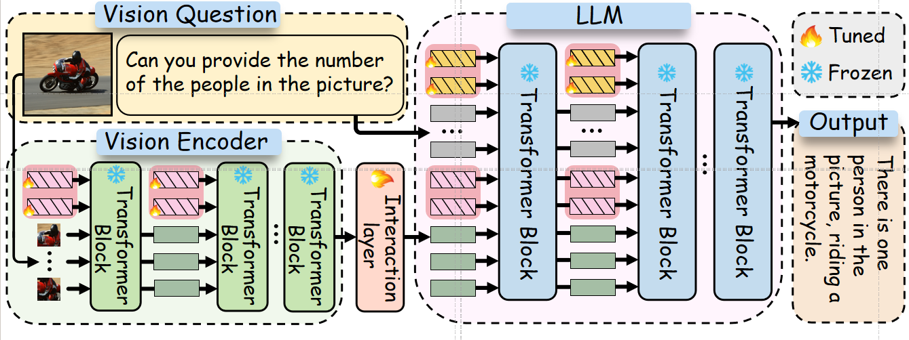

Official Repo of ***M$^2$PT: Multimodal Prompt Tuning for Zero-shot Instruction Learning***

(👉Under construction! The key code is uploaded. However, there are several redundancies in the current version, and the commands/instructions are not perfectly ready for formal release. I will gradually update it! Please stay tuned.)

This repository contains the official PyTorch implementation for ***M$^2$PT: Multimodal Prompt Tuning for Zero-shot Instruction Learning***. Our work is based on [LLaVA](https://github.com/haotian-liu/LLaVA), and we thank the great work of them.

<!---->
<div align="center">
  
</div>
<p align="center">
 Figure1: Overview of our M$^2$PT approach. Here, visual prompts are embedded into each layer of the Visual Encoder, and textual prompts are embedded into each layer of the LLM. These prompts facilitate the extraction and alignment of features across modalities (e.g., vision, language). The cross-modality interaction between visual and textual features is enhanced through layered integration, ultimately improving the model's capability in zero-shot instruction learning tasks.
</p>

## Install

1.  Clone this repository and navigate to LLaVA folder

```bash
git clone git@github.com:William-wAng618/M2PT-emnlp2024.git
cd M2PT-emnlp2024
```

2.  Install Package

```Shell
conda create -n m2pt python=3.10 -y
conda activate m2pt
pip install --upgrade pip  # enable PEP 660 support
pip install -e .
```

3.  Install additional packages for training cases

<!---->

    pip install -e ".[train]"
    pip install flash-attn --no-build-isolation

## Stage-one LLaVA_align Weights

The weigth for stage-1 Align is [liuhaotian/llava-pretrain-vicuna-7b-v1.3](https://huggingface.co/liuhaotian/llava-pretrain-vicuna-7b-v1.3) and  [lmsys/vicuna-7b-v1.3](https://huggingface.co/lmsys/vicuna-7b-v1.3) please download it for M$^2$PT.

## M2PT-emnlp2024

1.  Prepare data.

Please download the annotation of the [Vision-Flan](https://huggingface.co/datasets/Vision-Flan/vision-flan_191-task_1k) 191k data and place it in playground.

    ├── M2PT-emnlp2024
    │   └── playground
    |       └──Vision-Flan (unzip here)

2.  Start training.

There are several parameter need to be notice in **==\scripts\PT\_full\_schedule.sh==**
*   `--PT_len_llm`: The num of textual prompts add in LLM.
*   `--PT_len_vision_encoder`: The num of visual prompts add in Vision encoder.

Then run:
```Shell
bash scripts/PT_full_schedule.sh
```

3.  Evaluation.
For evaluation, please use:
```
./M2PT-emnlp2024/eval/model_vqa_loader_PT_mme.py
```
